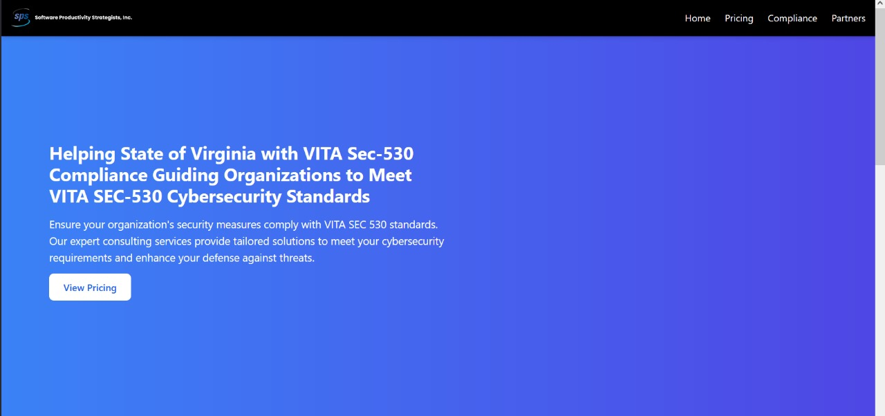
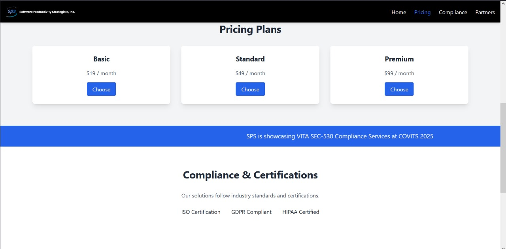
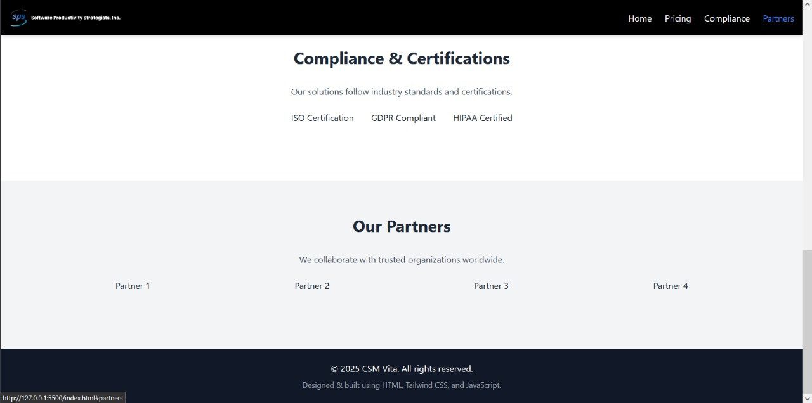

# 📖 CSM Vita – Internship Task (Basic HTML/CSS/JS)

This project is part of my internship task. There were multiple options (React, Next.js, etc.), but I chose to implement it using **basic HTML, CSS (Tailwind)**, and **JavaScript**, because my goal is to strengthen my fundamentals first.  

---

## 🔹 Project Overview
This project is a static website rebuild of:  
👉 [Original Reference](https://vita.spsnet.com/csm-vita/)  

The main goal was to apply **HTML, CSS (Tailwind), JavaScript/jQuery**, along with **SEO techniques** and **security best practices**, while also meeting the client’s requirement of showing **maximum content in the first view**:  
- Navbar  
- Banner (Hero Section)  
- Pricing  
- Marquee  
- Compliance  
- Partners  

---

## 🔹 Frontend Concepts Implemented
- **HTML5 Semantic Structure** (`header`, `main`, `section`, `footer`)  
- **CSS3 Styling** (Tailwind for responsive design)  
- **Responsive Layout** (mobile, tablet, desktop support)  
- **JavaScript/jQuery** (for interactivity like marquee, toggles, animations)  
- **Reusable Components** (structured sections: Navbar, Banner, Pricing, etc.)  

---

## 🔹 SEO Techniques Implemented
- Added meta title & description for each page  
- Used semantic HTML tags for better indexing  
- Proper heading hierarchy (H1 → H2 → H3)  
- Added alt attributes for all images  
- Configured `robots.txt` and `sitemap.xml`  
- Added Open Graph (OG) tags for social media  
- Optimized images & enabled lazy loading  
- Improved page load performance  

---

## 🔹 Security Best Practices Implemented
- Enforced **HTTPS links only**  
- Applied **Content Security Policy (CSP)**  
- Set important security headers:
  - Strict-Transport-Security (HSTS)  
  - X-Content-Type-Options  
  - X-Frame-Options  
  - Permissions-Policy  
- Prevented XSS by sanitizing user input (if any forms exist)  
- Avoided exposing sensitive data in frontend code  
- Validated all form inputs (client-side validation with JavaScript/jQuery)  

---

## 🔹 Folder Structure
/project
/assets
/css
style.css
/js
script.js
/images
/icons
index.html
about.html
## 🔹 Screenshots

### Home Section

### Pricing Section

### Compliance Section

